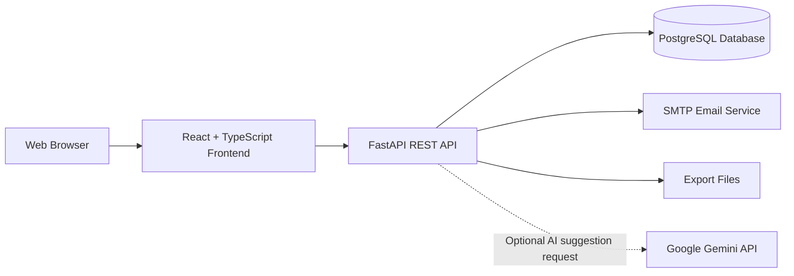
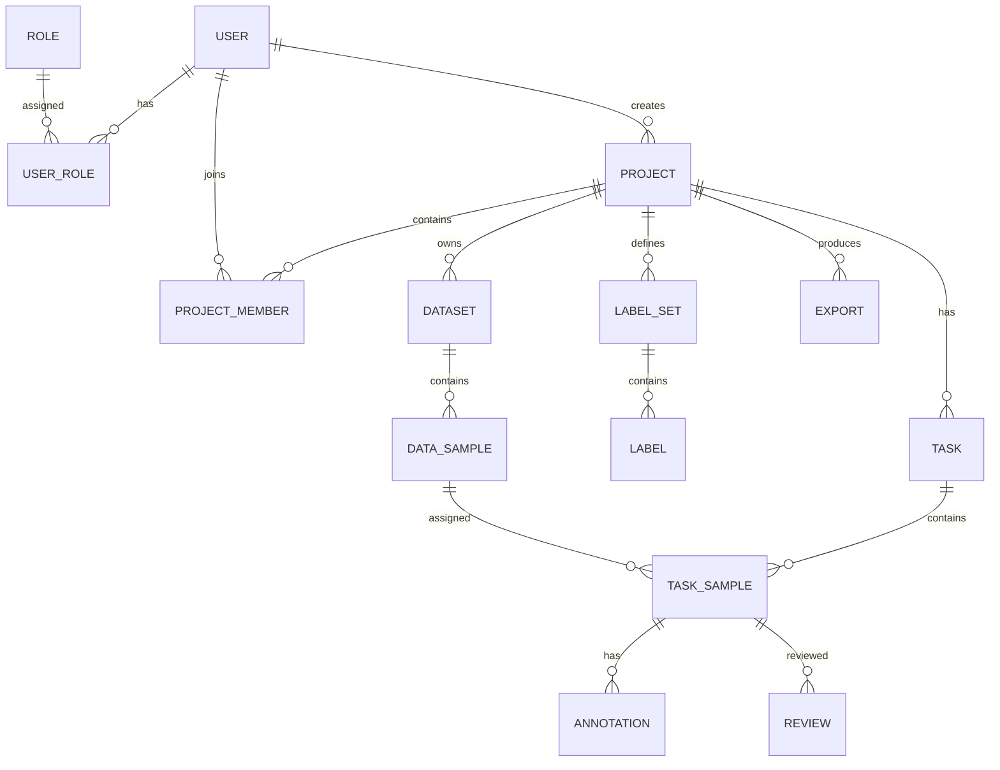
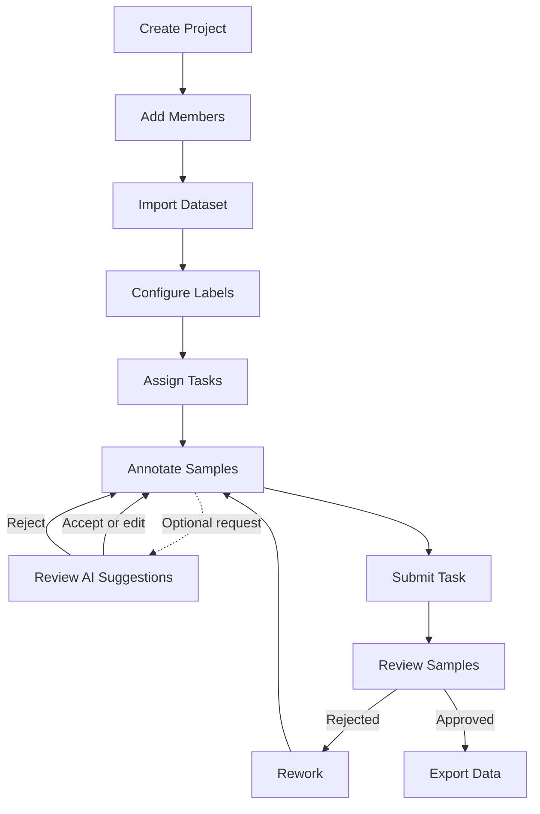

# BACHELOR THESIS DRAFT

## Title

**TEXT LABELING PLATFORM FOR NATURAL LANGUAGE PROCESSING DATASET ANNOTATION**

Author: [Your full name]  
Student ID: [Your student ID]  
Program: Information Communication and Technology  
University: University of Science and Technology of Hanoi  
Internal supervisor: [Supervisor name]  
External supervisor: [Supervisor name, if any]  
Hanoi, 2026

---

# ATTESTATION

I declare that this thesis was prepared by myself under the guidance of my supervisors. The system design, implementation, analysis, and results presented in this report are based on my own work on the Text Labeling Platform project. Any external materials, technical documentation, and references used during the project are cited in the references section.

I take full responsibility for the originality of this report and for any intellectual property issues related to the content presented here.

Author: [Your full name]

---

# ACKNOWLEDGEMENTS

I would like to express my sincere gratitude to my supervisors for their guidance, feedback, and encouragement throughout the development of this project. Their advice helped me transform the initial idea into a working full-stack application and understand the practical challenges of building reliable software for data annotation workflows.

I am also grateful to the lecturers and staff of the University of Science and Technology of Hanoi for providing the academic foundation in software engineering, databases, web development, and information systems that supported this thesis.

Finally, I would like to thank my family and friends for their support during the implementation and writing process. Their encouragement helped me stay focused and complete this project.

---

# LIST OF ABBREVIATIONS

| Abbreviation | Meaning |
| --- | --- |
| AI | Artificial Intelligence |
| API | Application Programming Interface |
| CSV | Comma-Separated Values |
| ERD | Entity Relationship Diagram |
| HTTP | Hypertext Transfer Protocol |
| JSON | JavaScript Object Notation |
| JSONL | JSON Lines |
| JWT | JSON Web Token |
| LLM | Large Language Model |
| NER | Named Entity Recognition |
| NLP | Natural Language Processing |
| QA | Quality Assurance |
| RBAC | Role-Based Access Control |
| REST | Representational State Transfer |
| SMTP | Simple Mail Transfer Protocol |
| UI | User Interface |
| UX | User Experience |

---

# TABLE OF CONTENTS

1. Chapter I: Introduction  
   1.1 Context and Motivation  
   1.2 Objectives  
   1.3 Expected Outcomes  
   1.4 Project Features  
   1.5 Thesis Structure  
2. Chapter II: Requirement Analysis  
   2.1 Overall System Requirements  
   2.2 Non-functional Requirements  
   2.3 Functional Requirements  
   2.4 Use Case and Scenario Description  
3. Chapter III: Methodology  
   3.1 System Architecture  
   3.2 Database Design  
   3.3 Main Workflow Design  
4. Chapter IV: Implementation  
   4.1 Tools and Technical Choices  
   4.2 Backend Implementation  
   4.3 Frontend Implementation  
   4.4 Security and Access Control  
5. Chapter V: Results  
   5.1 Achievements  
   5.2 Verification Status 
   5.3 Limitations 
   5.4 Future Work 
   5.5 Conclusion 
6. References  
7. Appendices

---

# CHAPTER I: INTRODUCTION

## 1.1 Context and Motivation

In recent years, Natural Language Processing has become an important area in information technology. Many applications such as text classification, information extraction, sentiment analysis, question answering, and automated document processing depend on high-quality labeled datasets. Before an NLP model can be trained or evaluated, raw text usually needs to be reviewed and annotated by humans according to a clear guideline.

However, manual annotation is often time-consuming and difficult to organize. When a dataset contains many text samples, the project owner must import the data, define labels, assign samples to annotators, monitor progress, review the quality of submitted annotations, and export the final result in a usable format. If these steps are handled through spreadsheets or informal communication, the workflow can easily become inconsistent. It is difficult to know which samples have been assigned, which samples are still pending, and which annotations have been approved by reviewers.

The motivation of this project is to build a web-based text labeling platform that supports the full lifecycle of dataset annotation. The system is designed for small and medium annotation teams where project owners, annotators, and reviewers need to collaborate in a structured environment. Instead of focusing only on the annotation interface, the platform also includes project management, dataset import, label configuration, task assignment, review, notification, export, and optional AI-assisted suggestion functions.

## 1.2 Objectives

The main objective of this thesis is to design and implement a full-stack web application for managing text annotation projects. The platform aims to provide an end-to-end workflow from raw data import to reviewed data export.

The specific objectives are:

- To design a role-based system for administrators, project owners, annotators, and reviewers.
- To allow project owners to create projects, manage members, import datasets, and configure labels.
- To support several annotation task types, including text classification, named entity recognition, sequence labeling, and relation extraction.
- To implement task assignment using manual and round-robin methods.
- To provide annotation workspaces where annotators can label text samples, save drafts, mark samples as completed, and submit tasks.
- To provide optional AI suggestions that remain under annotator control before they are saved.
- To provide review workspaces where reviewers can approve or reject annotations and send feedback for rework.
- To export approved labeled data in common formats such as JSON, JSONL, and CSV.
- To build a usable frontend interface and a structured backend API suitable for future extension.

## 1.3 Expected Outcomes

At the end of the project, the expected result is a working web application with the following outcomes:

For administrators:

- Manage user accounts and system roles.
- Lock, unlock, create, update, and reset user accounts.
- Access all projects when necessary.

For project owners:

- Create and update annotation projects.
- Add or remove project members and assign project roles.
- Import text datasets from supported formats.
- Configure label sets and label groups.
- Assign samples to annotators and reviewers.
- Monitor annotation, review, and export progress.
- Export labeled data after review.
- Manage versioned project guidelines through backend APIs.

For annotators:

- View assigned tasks.
- Open an annotation workspace for each task.
- Apply classification labels, select entity spans, and create relation links.
- Request AI suggestions, review their confidence scores, and accept, edit, or reject them before saving.
- Save drafts and navigate between samples.
- Mark samples as done and submit completed tasks.
- Receive review feedback and fix rejected samples.

For reviewers:

- View submitted tasks in the review queue.
- Inspect annotations and related metadata.
- Approve correct samples.
- Reject incorrect samples with feedback.
- Submit review results and trigger rework or completion.

## 1.4 Project Features

The Text Labeling Platform includes the following main features:

- Authentication with access tokens, refresh tokens, logout, password reset, and account lockout after repeated failed login attempts.
- User and role management for administrator-level control.
- Project management with project code, name, objective, priority, deadline, status, and progress metrics.
- Member management inside each project with project owner, annotator, and reviewer roles.
- Dataset import from CSV, JSON, and JSONL files parsed in the browser and submitted to the backend as normalized inline samples.
- Label set management with label groups, colors, shortcut keys, and required label options.
- Versioned project guideline storage through backend APIs.
- Task assignment using manual sample counts or round-robin distribution.
- Annotation workspaces for text classification, NER, sequence labeling, and relation extraction.
- Optional Gemini-backed AI suggestions for text classification, NER, and relation extraction with explicit annotator review before persistence.
- Draft saving and task sample status management.
- Review and QA workflow with approval, rejection, feedback, and rework.
- Export of labeled records in JSON, JSONL, and CSV.
- Dashboard, notification bell, settings page, and project progress overview.

## 1.5 Thesis Structure

This thesis is organized into five main chapters.

Chapter I introduces the project context, motivation, objectives, expected outcomes, and main features.  
Chapter II analyzes system requirements, including functional and non-functional requirements and use case descriptions.  
Chapter III presents the methodology, architecture, database design, and main workflows.  
Chapter IV describes the implementation details of the backend, frontend, security, and main modules.  
Chapter V summarizes the results, limitations, future work, and conclusion.

---

# CHAPTER II: REQUIREMENT ANALYSIS

## 2.1 Overall System Requirements

The platform is a web-based application. Users interact with the system through a browser, while the backend exposes RESTful APIs and stores data in a PostgreSQL database.

Development environment:

- Operating system: Windows, Linux, or macOS.
- Code editor: Visual Studio Code or equivalent.
- Backend runtime: Python with FastAPI.
- Frontend runtime: Node.js with React and Vite.
- Database: PostgreSQL.
- Containerization: Docker and Docker Compose for local backend and database execution.

Client environment:

- A modern web browser such as Chrome, Edge, Firefox, or Brave.
- Network access to the frontend and backend services.
- A user account with the correct system role and project membership.

Software dependencies:

- Backend: FastAPI, Uvicorn, Pydantic, SQLAlchemy, asyncpg, Alembic, python-jose, Passlib, bcrypt, HTTPX, aiosmtplib, Jinja2, and related utilities.
- Frontend: React, TypeScript, Vite, React Router, Axios, Zustand, Tailwind CSS, and Lucide React.
- External optional service: Google Gemini API for on-demand annotation suggestions.

## 2.2 Non-functional Requirements

### 2.2.1 Usability

The system should provide an intuitive interface for users with different responsibilities. Project owners should be able to move from project creation to dataset import, label configuration, assignment, review monitoring, and export without switching tools. Annotators should be able to focus on one sample at a time, navigate between samples, and clearly understand which samples are pending, done, submitted, approved, or rejected.

### 2.2.2 Security

The system must protect user accounts and project data. Authentication is handled with JWT-based access and refresh tokens. Passwords are stored as hashed values using bcrypt. Refresh tokens and password reset tokens are stored as hashes. The system also includes failed login tracking and temporary account lockout after multiple invalid attempts.

Authorization must be role-based. Administrators have global management rights. Project owners can manage their own projects. Annotators can access assigned tasks. Reviewers can access submitted tasks for projects where they are reviewers.

### 2.2.3 Reliability

The system should keep annotation data consistent across the workflow. For example, a dataset with existing assigned tasks cannot be deleted directly, a submitted task cannot be reviewed until its samples have been marked complete, and export can be limited to approved samples only. These rules reduce accidental data loss and improve the quality of the final dataset.

### 2.2.4 Maintainability

The backend is organized into models, schemas, services, and API endpoint modules. This separation allows each business domain to be maintained independently. The frontend is organized into pages, components, API clients, stores, and utilities. The use of TypeScript improves maintainability by making data structures explicit.

### 2.2.5 Scalability

The database schema separates projects, datasets, samples, tasks, task samples, annotations, reviews, exports, and notifications. This design allows the system to support multiple projects and multiple annotation teams. The backend uses asynchronous database access, which is suitable for handling concurrent API requests.

### 2.2.6 AI Assistance Safety

AI suggestions must not silently become ground-truth labels. The backend sends suggestion requests to Gemini only when an annotator explicitly asks for assistance. Returned data is validated against allowed labels, confidence ranges, entity offsets, and relation endpoints. Suggestions remain temporary until the annotator accepts or edits them and saves them through the normal annotation workflow.

## 2.3 Functional Requirements

The main functional requirements are:

- Users can log in, log out, refresh tokens, update their profile, change password, and reset forgotten passwords.
- Administrators can create, list, update, lock, unlock, delete, and reset user accounts.
- Project owners can create, update, archive, delete, and list projects.
- Project owners can add, update, and remove project members.
- Project owners can import browser-parsed CSV, JSON, or JSONL datasets and view dataset samples.
- Project owners can create label sets, label groups, and labels.
- Project owners can create versioned annotation guidelines through backend APIs.
- Project owners can assign tasks manually or with round-robin distribution.
- Annotators can view assigned tasks, start tasks, annotate text, save drafts, mark samples as done, and submit tasks.
- Annotators can request, review, edit, accept, or reject Gemini-backed AI suggestions before saving annotations.
- Reviewers can view a review queue, inspect submitted samples, approve or reject samples, and submit review results.
- Project owners can export labeled data in JSON, JSONL, or CSV.
- Users can view notifications and update notification preferences.
- Dashboard pages can display project and progress statistics.

## 2.4 Use Case and Scenario Description

### 2.4.1 Login

| Item | Description |
| --- | --- |
| Use case name | Login |
| Actor | Registered user |
| Brief definition | The user authenticates with email and password to access the platform. |
| Main flow | 1. The user opens the login page. 2. The user enters email and password. 3. The frontend sends the credentials to the authentication API. 4. The backend verifies the password and account status. 5. The system returns access and refresh tokens. 6. The user is redirected to the dashboard. |
| Alternative flow | If credentials are invalid, the system shows a generic error message. If the account is locked, the system blocks login until the lockout period expires. |
| Pre-condition | The user account exists and is active. |
| Post-condition | The user is authenticated and can access protected pages. |

### 2.4.2 Manage Users

| Item | Description |
| --- | --- |
| Use case name | Manage Users |
| Actor | Administrator |
| Brief definition | The administrator manages user accounts and system roles. |
| Main flow | 1. The administrator opens the user management page. 2. The system displays user accounts with role and status information. 3. The administrator creates, edits, locks, unlocks, deletes, or resets a user password. 4. The system validates the request and updates the database. |
| Alternative flow | If a user email already exists or input validation fails, the system displays an error. |
| Pre-condition | The current user has administrator privileges. |
| Post-condition | User information is updated in the system. |

### 2.4.3 Create Project

| Item | Description |
| --- | --- |
| Use case name | Create Project |
| Actor | Project owner or administrator |
| Brief definition | A user creates a new annotation project. |
| Main flow | 1. The user opens the Projects page. 2. The user enters project name, code, objective, description, deadline, and priority. 3. The backend validates uniqueness of the project code. 4. The system creates the project. 5. The creator is added as project owner. |
| Alternative flow | If the project code already exists, the system rejects the request. If no code is provided, the system generates a unique project code. |
| Pre-condition | The user is authenticated. |
| Post-condition | A new project exists and is visible to the owner. |

### 2.4.4 Manage Project Members

| Item | Description |
| --- | --- |
| Use case name | Manage Project Members |
| Actor | Project owner or administrator |
| Brief definition | The project owner adds, updates, or removes members from a project. |
| Main flow | 1. The owner opens the project detail page. 2. The owner searches for an existing user. 3. The owner selects a project role. 4. The system adds the user as a member. 5. The owner can later update the role or remove the member. |
| Alternative flow | If the user is already a member, the system reports a conflict. If the owner tries to remove the last project owner, the system blocks the action. |
| Pre-condition | The project exists and the current user has owner rights. |
| Post-condition | Project membership is updated. |

### 2.4.5 Import Dataset

| Item | Description |
| --- | --- |
| Use case name | Import Dataset |
| Actor | Project owner or administrator |
| Brief definition | The user imports raw text samples into a project. |
| Main flow | 1. The owner opens the dataset tab. 2. The owner selects CSV, JSON, or JSONL files, or enters text samples. 3. The frontend parses file content into normalized sample objects. 4. The backend validates source format and sample content. 5. Valid samples are saved as data samples. 6. The dataset status becomes ready. |
| Alternative flow | Empty samples are skipped. If no valid samples are found, the dataset is marked as error and the import request fails. |
| Pre-condition | The project exists and the user is a project owner. |
| Post-condition | A ready dataset is available for task assignment. |

### 2.4.6 Configure Labels

| Item | Description |
| --- | --- |
| Use case name | Configure Labels |
| Actor | Project owner or administrator |
| Brief definition | The user creates label sets used by annotation tasks. |
| Main flow | 1. The owner opens the label configuration tab. 2. The owner creates a label set. 3. The owner adds labels with names, colors, shortcut keys, and optional groups. 4. The labels are saved and become available during task assignment. |
| Alternative flow | If required fields are missing or a shortcut key is duplicated inside a label set, the system rejects the request. |
| Pre-condition | The project exists. |
| Post-condition | A label set is available for annotation tasks. |

### 2.4.7 Assign Tasks

| Item | Description |
| --- | --- |
| Use case name | Assign Tasks |
| Actor | Project owner or administrator |
| Brief definition | The owner assigns dataset samples to annotators and optionally reviewers. |
| Main flow | 1. The owner selects a ready dataset. 2. The owner selects annotation type and label set. 3. The owner chooses manual or round-robin assignment. 4. The system collects unassigned samples. 5. The system creates tasks and task-sample records. 6. Assigned users receive notifications. |
| Alternative flow | If the dataset is not ready, no samples remain, or selected users are not valid annotators or reviewers, the system rejects the request. |
| Pre-condition | A ready dataset and at least one annotator are available. |
| Post-condition | Tasks are created and visible to assigned annotators. |

### 2.4.8 Annotate Samples

| Item | Description |
| --- | --- |
| Use case name | Annotate Samples |
| Actor | Annotator |
| Brief definition | The annotator labels assigned text samples. |
| Main flow | 1. The annotator opens an assigned task. 2. The system starts the task if needed. 3. The annotator selects labels or text spans according to the task type. 4. The system creates, updates, or deletes annotation records. 5. The annotator marks samples as done. 6. After all samples are done, the annotator submits the task. |
| Alternative flow | The annotator can save a draft and continue later. If some samples are unfinished, the system prevents submission. |
| Pre-condition | The task is assigned to the annotator. |
| Post-condition | The task is submitted for review. |

### 2.4.9 Review Annotations

| Item | Description |
| --- | --- |
| Use case name | Review Annotations |
| Actor | Reviewer or project owner |
| Brief definition | The reviewer checks submitted annotations and accepts or rejects samples. |
| Main flow | 1. The reviewer opens the review queue. 2. The reviewer selects a submitted task. 3. The reviewer inspects each sample and its annotations. 4. The reviewer approves correct samples or rejects incorrect samples with feedback. 5. The reviewer submits the review. |
| Alternative flow | If any sample is rejected, the task returns to the annotator for rework. If all samples are approved, the task is marked approved. |
| Pre-condition | The task has been submitted and the current user has review access. |
| Post-condition | The task becomes approved or rework. |

### 2.4.10 Export Labeled Data

| Item | Description |
| --- | --- |
| Use case name | Export Labeled Data |
| Actor | Project owner or administrator |
| Brief definition | The owner exports annotated data for downstream use. |
| Main flow | 1. The owner opens the export modal. 2. The owner selects format and filter mode. 3. The system collects matching task samples and annotations. 4. The backend creates an export record. 5. The frontend downloads the export data. |
| Alternative flow | If no records match the selected criteria, the system reports that no exportable data is available. |
| Pre-condition | The project contains annotated data. |
| Post-condition | A JSON, JSONL, or CSV export is generated. |

### 2.4.11 Manage Annotation Guidelines

| Item | Description |
| --- | --- |
| Use case name | Manage Annotation Guidelines |
| Actor | Project owner or administrator |
| Brief definition | The user creates versioned annotation instructions for a project through backend APIs. |
| Main flow | 1. The owner submits guideline content or a file URL. 2. The backend checks project-owner permission. 3. The system calculates the next guideline version. 4. The guideline version is stored. 5. Project members can retrieve the latest version. |
| Alternative flow | If the project does not exist or the current user lacks permission, the backend rejects the request. |
| Pre-condition | The project exists and the current user is an owner or administrator. |
| Post-condition | A new guideline version is available through the API. |

### 2.4.12 Request and Accept AI Suggestions

| Item | Description |
| --- | --- |
| Use case name | Request and Accept AI Suggestions |
| Actor | Annotator |
| Brief definition | The annotator requests optional Gemini-backed suggestions and decides which labels to save. |
| Main flow | 1. The annotator opens a classification, NER, or relation extraction sample. 2. The annotator requests AI suggestions. 3. The backend sends the source text, allowed labels, and relation entities when needed to Gemini. 4. The backend validates the structured response. 5. The frontend displays suggestions and confidence scores. 6. The annotator edits, accepts, or rejects suggestions. 7. Accepted items are saved through the normal annotation endpoints with AI-assistance metadata. |
| Alternative flow | If the API key is missing, Gemini is unavailable, output validation fails, or no suitable suggestion is returned, the system displays an error or an empty result and does not save annotations. |
| Pre-condition | The annotator is authenticated, the sample is editable, and relevant labels are configured. Relation extraction also requires at least two entities. |
| Post-condition | Only annotator-approved suggestions become stored annotations. |

---

# CHAPTER III: METHODOLOGY

## 3.1 System Architecture

The Text Labeling Platform follows a three-layer web application architecture:

1. Presentation layer: a React and TypeScript frontend that provides pages, forms, modals, workspaces, and navigation.
2. Application layer: a FastAPI backend that exposes RESTful endpoints, handles authentication, validates requests, enforces permissions, and executes business logic.
3. Data layer: a PostgreSQL database accessed through SQLAlchemy models and asynchronous sessions.

The frontend communicates with the backend using HTTP requests through Axios. The backend returns JSON responses. Protected API routes require a bearer access token. The database is used to store users, roles, projects, members, datasets, samples, label sets, tasks, annotations, reviews, exports, notifications, and audit logs. For optional AI assistance, the backend calls the Gemini API with HTTPX and returns validated temporary suggestions to the frontend.

Suggested architecture diagram placeholder:

## 3.2 Database Design

The database design is centered on the annotation project workflow. A user can have system roles such as administrator, project owner, annotator, and reviewer. A project has members with project-specific roles. Each project can contain multiple datasets, label sets, tasks, reviews, and exports.

Main entities:

- User: stores account information, status, password hash, login failure count, lockout time, and notification preferences.
- Role and UserRole: store system-level role-based access control.
- Project: stores project metadata such as code, name, objective, priority, status, creator, and deadline.
- ProjectMember: stores the role of a user inside a project.
- Guideline: stores project annotation instructions and versions.
- Dataset: stores dataset metadata and import status.
- DataSample: stores individual raw text samples and metadata.
- LabelSet, LabelGroup, and Label: store annotation label configuration.
- Task: stores assignment information for an annotator, reviewer, dataset, label set, and task type.
- TaskSample: connects tasks to data samples and tracks sample-level status.
- Annotation: stores labeled text spans with offsets, selected text, label, and optional AI-assistance metadata such as model name and confidence.
- AnnotationDraft: stores auto-saved draft annotation data.
- Review: stores reviewer decisions and feedback.
- Export: stores export history and generated file information.
- Notification: stores user notifications.
- AuditLog: stores important user actions for traceability.

Suggested database diagram placeholder:

## 3.3 Main Workflow Design

The project workflow is designed as a pipeline:

1. A project owner creates a project and adds members.
2. The project owner imports one or more datasets.
3. The project owner creates label sets for the annotation task.
4. The project owner assigns samples to annotators and optionally reviewers.
5. Annotators work on assigned tasks, optionally request AI suggestions, review or edit them, and save selected labels.
6. Reviewers approve or reject submitted samples.
7. Rejected tasks return to annotators for rework.
8. Approved samples become available for export.

Suggested workflow diagram:

---

# CHAPTER IV: IMPLEMENTATION

## 4.1 Tools and Technical Choices

### 4.1.1 FastAPI

FastAPI was selected for the backend because it provides a modern Python framework for building APIs with type hints, request validation, dependency injection, and automatic API documentation. It is suitable for developing modular REST endpoints and supports asynchronous request handling.

### 4.1.2 PostgreSQL

PostgreSQL was selected as the relational database system. The platform contains many related entities, such as projects, datasets, tasks, annotations, and reviews. A relational database is appropriate because it supports foreign keys, constraints, indexes, and structured queries.

### 4.1.3 SQLAlchemy and Alembic

SQLAlchemy is used as the ORM layer to map Python classes to database tables. Alembic is used to manage database migrations. This allows the schema to evolve over time while keeping the database structure traceable.

### 4.1.4 React and TypeScript

React is used to build the frontend user interface. TypeScript improves code reliability by defining interfaces for projects, users, datasets, tasks, annotations, labels, and API responses. This reduces mistakes when frontend data structures change.

### 4.1.5 Vite

Vite is used as the frontend build tool and development server. It provides fast development feedback and a straightforward production build process.

### 4.1.6 Docker

Docker Compose is used to run the backend service and PostgreSQL database locally. This makes the development environment easier to reproduce.

### 4.1.7 Gemini API and HTTPX

The platform uses the Google Gemini API as an optional external suggestion provider. HTTPX is used by the FastAPI backend to send asynchronous requests. The API key, model name, and timeout are loaded from environment variables. The default model configured in the current project is `gemini-2.5-flash`.

## 4.2 Backend Implementation

The backend is organized into the following main folders:

- `app/models`: SQLAlchemy database models.
- `app/schemas`: Pydantic request and response schemas.
- `app/services`: business logic for each domain.
- `app/api/v1/endpoints`: API route handlers.
- `app/core`: configuration, database connection, security utilities, exceptions, and seed data.
- `alembic`: database migration files.

### 4.2.1 Authentication Module

The authentication module supports login, logout, refresh token rotation, password reset, profile update, and password change. When a user logs in, the backend verifies the email and password, checks account status, creates an access token and refresh token, stores a hash of the refresh token, and returns user information.

The system also tracks failed login attempts. After the configured maximum number of failed attempts, the user account is temporarily locked. This protects the platform against repeated password guessing.

### 4.2.2 User Management Module

The user management module allows administrators to list users, create users, update user information, delete users, lock or unlock accounts, reset passwords, and view available roles. This module supports system-level administration and ensures that only authorized accounts can access annotation projects.

### 4.2.3 Project Management Module

The project module supports creating, listing, updating, archiving, and deleting projects. When a project is created, the creator is automatically added as project owner. The project response also includes computed progress statistics, such as total samples, assigned samples, annotated samples, pending review samples, approved samples, exported samples, and progress percentages.

Project owners can add members with project-specific roles. The system prevents removing or demoting the last project owner, which helps avoid projects without an owner.

### 4.2.4 Dataset Module

The dataset module handles importing text samples into a project. The frontend accepts CSV, JSON, and JSONL files, parses them in the browser, and submits normalized inline sample objects. The backend validates the project owner permission, declared source format, and sample content. Empty samples are skipped, while valid samples are stored as `DataSample` records. After import, the dataset status becomes ready.

The module also provides dataset listing, dataset detail, paginated sample listing, and dataset deletion. Deletion is blocked when the dataset already has assigned tasks, preventing accidental loss of annotation work.

### 4.2.5 Label Module

The label module manages the annotation ontology of each project. A project can have multiple label sets. Each label set can contain labels and optional label groups. Labels include display color, shortcut key, ordering, and required flag. This design supports different NLP tasks, including text classification, NER, sequence labeling, and relation extraction.

### 4.2.6 Task Assignment Module

The task module creates assignments from dataset samples. It supports two methods:

- Manual assignment: the project owner selects annotators and specifies the number of samples each annotator should receive.
- Round-robin assignment: the system distributes unassigned samples evenly across selected annotators.

The task module validates dataset readiness, label set ownership, annotator roles, reviewer roles, duplicate assignment constraints, and available sample counts. It creates both `Task` and `TaskSample` records. Reviewers can also be assigned in a round-robin manner across created tasks.

### 4.2.7 Annotation Module

The annotation module handles annotator workflows. Annotators can view their tasks, start a task, open samples, create annotations, update annotations, delete annotations, bulk update annotations, save drafts, mark sample status, navigate between samples, and submit a task.

Each annotation stores the task sample, label, character offsets, selected text, creator, and optional AI metadata fields. These fields distinguish accepted AI-assisted annotations from labels created manually. The draft model stores temporary annotation data so that unfinished work is not lost.

### 4.2.8 Review Module

The review module supports quality assurance. Reviewers can view a queue of submitted samples, open a sample for review, inspect annotations, approve samples, reject samples with feedback, and submit the full review result. If at least one sample is rejected, the task becomes rework. If all samples are approved, the task becomes approved and can be exported.

Review history is stored to provide traceability. Rejected tasks include feedback for annotators, allowing them to correct their work.

### 4.2.9 Export Module

The export module collects annotated samples from a project and generates output data in JSON, JSONL, or CSV. It can export only approved samples or all samples depending on the selected filter. The exported records contain sample identifiers, content, annotation labels, offsets, and selected text.

Export records are saved in the database so that project owners can view export history. The system also creates an export-ready notification after a successful export.

### 4.2.10 AI Suggestion Module

The AI suggestion module provides an on-demand, human-in-the-loop workflow. It supports three suggestion modes:

- Text classification: suggests one or more configured labels for a text sample.
- NER: suggests entity text, labels, and exact character offsets.
- Relation extraction: suggests typed relations between existing entity identifiers without inventing new endpoints.

The backend sends requests to Gemini with a JSON response schema and validates the response again after parsing. It checks configured labels, confidence ranges, NER offsets, exact selected text, distinct relation endpoints, and known entity identifiers. Suggestions are ephemeral: the suggestion endpoint does not write annotation records. Persistence occurs only after an annotator accepts or edits a suggestion and saves it through the regular annotation endpoints.

### 4.2.11 Notification and Audit Log Modules

Notifications are used to inform users about important events, such as task assignment, task submission, review completion, task rejection, project deadlines, annotation milestones, and export readiness. Users can view notifications and mark them as read.

Audit logs record important actions such as login, project creation, dataset import, task assignment, annotation review, and export. This provides traceability and supports later debugging or administrative review.

## 4.3 Frontend Implementation

The frontend is built with React, TypeScript, React Router, Axios, Zustand, and Tailwind CSS. It contains several main pages:

- Login page: authenticates users and stores session state.
- Dashboard page: displays summary statistics and recent activity.
- Projects page: lists projects and provides project creation, edit, member, and export history controls.
- Project Details page: contains tabs for overview, data type, datasets, label configuration, assignment, annotation tasks, review tasks, and completed tasks. Member management is available from the project overview, and export is opened from project controls.
- Workspace page: provides text classification and NER annotation interfaces with optional AI suggestions.
- Relation Workspace page: provides relation extraction support using entities, relation links, drafts, and optional AI relation suggestions.
- Review Workspace page: provides reviewer tools for approving or rejecting samples.
- Users page: provides administrator user management.
- Settings page: provides profile, security, appearance, notification, and system settings.

The frontend uses API clients to call backend endpoints. It also defines TypeScript interfaces for project, user, dataset, task, annotation, label, AI suggestion, and response structures. This makes the frontend implementation more consistent with the backend contract.

## 4.4 Security and Access Control

The system applies security at multiple levels:

- Passwords are hashed using bcrypt.
- Access tokens are short-lived JWTs.
- Refresh tokens are stored as hashes and rotated when refreshed.
- Password reset tokens are stored as hashes and marked as used after reset.
- Failed login attempts are counted and accounts can be temporarily locked.
- Backend endpoints check the current user and required role before performing sensitive actions.
- Project-level access is checked using project membership.
- Project owners and administrators can manage projects, datasets, labels, assignments, and exports.
- Annotators can access only assigned tasks unless they also have higher privileges.
- Reviewers can access submitted tasks only in projects where they have reviewer or owner rights.
- The Gemini API key remains on the backend and is not exposed to the browser.
- Source text is treated as untrusted data in the AI prompt, AI output is schema-validated, and suggestions require explicit annotator confirmation before persistence.

---

# CHAPTER V: RESULTS

## 5.1 Achievements

The project successfully produced a functional full-stack text labeling platform. The implemented system includes core modules required for managing an annotation workflow:

- User authentication and role-based access control.
- Project creation and member management.
- Dataset import and sample browsing.
- Label set, label group, and label configuration.
- Manual and round-robin task assignment.
- Annotation workspaces for text classification, NER, and relation extraction tasks.
- Optional Gemini-backed suggestions that remain under annotator review before persistence.
- Draft saving and task submission.
- Review workflow with approval, rejection, feedback, and rework.
- Export of labeled data in JSON, JSONL, and CSV.
- Dashboard, notification, settings, and audit log support.
- Versioned annotation guideline storage through backend APIs.

The platform provides a structured workflow that is more reliable than managing annotation tasks through spreadsheets. It separates responsibilities between project owners, annotators, reviewers, and administrators. It also records task and sample statuses, which helps teams monitor project progress.

## 5.2 Verification Status

The repository was reviewed and checked locally on May 31, 2026. The following commands completed successfully:

| Verification item | Command or endpoint | Result |
| --- | --- | --- |
| Frontend lint | `npm.cmd run lint` | Passed |
| Frontend production build | `npm run build` | Passed with bundle-size warnings |
| Backend static lint | `docker exec tlp_api ruff check app alembic` | Passed |
| Backend bytecode compilation | `docker exec tlp_api python -m compileall app` | Passed |
| Running service health check | `GET /health` | Returned `{"status":"healthy","app":"Text Labeling Platform","env":"development"}` |

The frontend build reported that the main JavaScript chunk is larger than 500 kB after minification and that a dynamic Axios-client import does not create a separate chunk because the same module is also imported statically. These warnings do not block the current build but identify an optimization opportunity.

No automated unit, integration, or end-to-end test suite was found in the current repository. The AI suggestion flow was reviewed statically and compiled successfully, but a live Gemini response was not included in this verification because it depends on an external API key and network service.

## 5.3 Limitations

Although the system implements the main workflow, several limitations remain:

- The current system focuses on text annotation and does not support image, audio, or video annotation.
- Dataset files are parsed in the browser and sent as inline sample objects; server-side upload processing and durable source-file storage are not yet implemented.
- The export function supports common formats but does not yet include advanced dataset formats used by some machine learning libraries.
- The platform does not yet include real-time collaboration between multiple annotators on the same sample.
- Quality metrics such as inter-annotator agreement are not yet implemented.
- AI suggestions are on-demand aids rather than autonomous labels. They require Gemini availability, a configured API key, and human validation; batch pre-labeling and measured suggestion-quality benchmarks are not yet implemented.
- Versioned guideline APIs exist in the backend, but a dedicated frontend editor and guideline-history screen are not yet implemented.
- The repository does not yet include automated unit, integration, or end-to-end tests.
- The frontend production bundle can be optimized further with code splitting.
- The current deployment and storage model is suitable for development and small teams, but production deployment would require durable object storage, monitoring, backup, CI/CD, and stronger secrets management.

## 5.4 Future Work

Future development can improve the system in the following directions:

- Add batch pre-annotation, AI provider configuration, and measured quality evaluation for AI suggestions.
- Add inter-annotator agreement metrics and reviewer analytics.
- Add more export formats for common machine learning frameworks.
- Add advanced search and filtering for samples and annotations.
- Add a frontend guideline editor, version comparison, and required guideline acknowledgement before annotation.
- Add server-side file upload processing and durable object storage for imported datasets and generated exports.
- Improve notification delivery through email or real-time WebSocket updates.
- Add project-level reports for productivity, review quality, and annotation consistency.
- Add automated backend, frontend, integration, and end-to-end test suites.
- Reduce the frontend bundle size with route-level code splitting.
- Improve deployment with CI/CD, monitoring, backup, and production-grade secrets management.

## 5.5 Conclusion

This thesis presented the design and implementation of a Text Labeling Platform for NLP dataset annotation. The system supports the complete annotation lifecycle, including project creation, dataset import, label configuration, task assignment, annotation, review, and export.

The project demonstrates how a full-stack web application can organize complex data labeling workflows and improve collaboration between project owners, annotators, and reviewers. By combining FastAPI, PostgreSQL, React, TypeScript, and optional Gemini-backed assistance, the platform provides a maintainable foundation for future annotation features and production-level improvements while keeping final labeling decisions under human control.

---

# REFERENCES

1. FastAPI Documentation, https://fastapi.tiangolo.com/
2. React Documentation, https://react.dev/
3. TypeScript Documentation, https://www.typescriptlang.org/docs/
4. PostgreSQL Documentation, https://www.postgresql.org/docs/
5. SQLAlchemy Documentation, https://docs.sqlalchemy.org/
6. Alembic Documentation, https://alembic.sqlalchemy.org/
7. Docker Documentation, https://docs.docker.com/
8. Vite Documentation, https://vite.dev/
9. JWT Introduction, https://jwt.io/introduction
10. Pydantic Documentation, https://docs.pydantic.dev/
11. Gemini API Reference, https://ai.google.dev/gemini-api/docs/api-overview
12. HTTPX Async Support, https://www.python-httpx.org/async/

---

# APPENDICES

## Appendix A: Suggested Screenshots

Insert screenshots of the following pages:

- Login page.
- Dashboard page.
- Project list page.
- Create project modal.
- Project overview page.
- Dataset import modal.
- Dataset samples modal.
- Label configuration page.
- Task assignment modal.
- Annotation workspace.
- Relation extraction workspace.
- AI suggestion panel for text classification or NER.
- AI relation suggestion panel.
- Review workspace.
- User management page.
- Settings page.
- Export modal and exported file example.

## Appendix B: Suggested Figures

Suggested figures to include in the final Word/PDF version:

- System architecture diagram.
- Database entity relationship diagram.
- Main annotation workflow diagram.
- Login sequence diagram.
- Dataset import sequence diagram.
- Task assignment sequence diagram.
- Annotation submission sequence diagram.
- AI suggestion request and acceptance sequence diagram.
- Review sequence diagram.
- Export sequence diagram.

## Appendix C: Suggested Tables

Suggested tables to include:

- List of abbreviations.
- Functional requirements.
- Non-functional requirements.
- Use case descriptions.
- Database table summary.
- API endpoint summary.
- Testing summary.
- Current implementation status summary.

## Appendix D: Current Implementation Status Snapshot

The following snapshot distinguishes complete workflows from partial implementation areas at the time of review on May 31, 2026.

| Area | Status | Notes |
| --- | --- | --- |
| Authentication and account security | Implemented | JWT access and refresh tokens, logout, password reset, password hashing, failed-login tracking, and temporary lockout are present. |
| User and role administration | Implemented | Administrator endpoints and frontend management page are present. |
| Project and member management | Implemented | Project metadata, project roles, owner safeguards, progress summaries, and member controls are present. |
| Dataset import and browsing | Implemented with current-scope limitation | Frontend parses CSV, JSON, and JSONL files; backend accepts normalized inline samples. Direct backend file upload is deferred. |
| Label configuration | Implemented | Label sets, groups, labels, colors, shortcuts, and required flags are present. |
| Versioned guidelines | Partially implemented | Database model, service, and API endpoints are present. A dedicated frontend authoring and history workflow is deferred. |
| Task assignment | Implemented | Manual and round-robin assignment, reviewer distribution, validation, and assignment editing controls are present. |
| Annotation workspaces | Implemented | Text classification, NER, relation extraction, draft saving, status changes, navigation, and submission are present. |
| AI annotation assistance | Implemented as optional assistance | Gemini-backed on-demand suggestions support classification, NER, and relations. Suggestions are validated and persist only after annotator approval. |
| Review and rework | Implemented | Queue, approval, rejection feedback, review submission, and rework flow are present. |
| Notifications, dashboard, and settings | Implemented | Dashboard statistics, recent activity, polling notification bell, read state, and notification preferences are present. |
| Export | Implemented with current-scope limitation | JSON, JSONL, and CSV exports are present. Generated files use temporary local storage in the current backend. |
| Automated testing and production operations | Deferred | Static checks and health verification pass, but automated test suites, durable storage, monitoring, backup, and CI/CD remain future work. |
